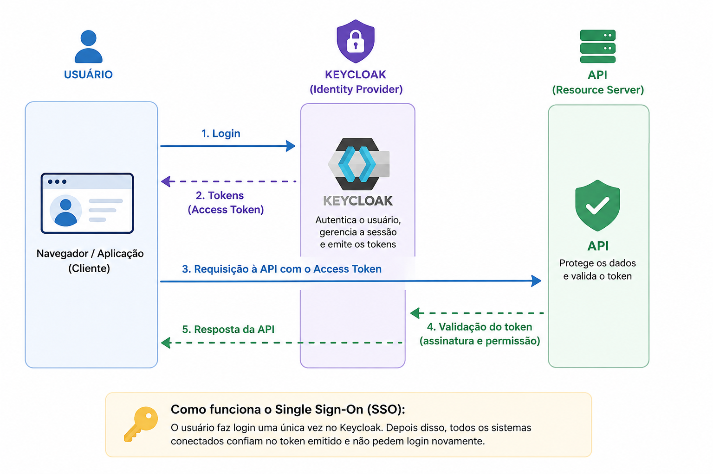

# Identity Security Platform

> Plataforma corporativa self-hosted de identidade, autenticação, gerenciamento de segredos e observabilidade — construída sobre Docker Compose com segregação de redes, princípio de menor privilégio e preparada para migração para arquitetura multi-VPS enterprise.



---

## Visão Geral

A **Identity Security Platform** é uma stack DevSecOps enterprise que centraliza:

- **SSO corporativo** com MFA obrigatório via TOTP (Keycloak 24)
- **Gerenciamento de secrets** centralizado com rotação e auditoria (Infisical)
- **Reverse proxy seguro** com security headers hardened (Nginx)
- **Acesso público sem portas abertas** via Cloudflare Zero Trust Tunnel
- **Relay SMTP** interno para Microsoft 365 (OAuth2-ready)
- **Observabilidade completa**: métricas, logs centralizados e uptime monitoring
- **Backup automatizado** criptografado com estratégia 3-2-1
- **Infraestrutura versionada** em Git, 100% reproduzível via scripts

O sistema de testes (`apps/weather-dashboard/`) demonstra integração com a plataforma e pode ser removido com `rm -rf apps/` após a validação.

---

## Stack de Componentes

| Componente        | Imagem                              | Função                                    | Redes participantes                  |
|-------------------|-------------------------------------|-------------------------------------------|--------------------------------------|
| **Keycloak**      | quay.io/keycloak/keycloak:24.0      | SSO, MFA, OIDC/SAML, gestão de identidade | auth-network, db-auth-network        |
| **Infisical**     | infisical/infisical:latest-postgres | Secrets centralizados, rotação, auditoria | auth-network, db-auth-network        |
| **PostgreSQL**    | postgres:15-alpine                  | Persistência do Keycloak e Infisical      | db-auth-network, backup-network      |
| **Redis**         | redis:7-alpine                      | Cache de sessões — ephemeral by design    | auth-network                         |
| **Nginx**         | nginx:1.25-alpine                   | Reverse proxy, TLS termination, headers   | edge, auth, monitoring               |
| **cloudflared**   | cloudflare/cloudflared:latest       | Tunnel Zero Trust — sem portas expostas   | edge-network                         |
| **SMTP Relay**    | boky/postfix:latest                 | Relay SMTP interno → Microsoft 365        | auth-network                         |
| **Grafana**       | grafana/grafana:10.4.0              | Dashboards + OIDC SSO via Keycloak        | monitoring-network, auth-network     |
| **Loki**          | grafana/loki:2.9.4                  | Logs centralizados, retenção 30 dias      | monitoring-network                   |
| **Uptime Kuma**   | louislam/uptime-kuma:1              | Uptime monitoring, alertas                | monitoring-network                   |

---

## Arquitetura de Redes Docker

5 redes Docker segregadas criadas explicitamente antes dos serviços. Nenhum container expõe portas diretamente ao host — todo tráfego externo passa por `cloudflared → nginx`. O princípio é deny-by-default: cada container só enxerga os serviços com quem precisa se comunicar.

```
                          Internet
                             │
                     Cloudflare CDN
                     WAF · DDoS · Zero Trust
                             │
              ┌──────────────────────────┐
              │       edge-network       │
              │   cloudflared   nginx    │
              └──────────┬───────────────┘
                         │
              ┌──────────────────────────────────────┐
              │            auth-network               │
              │  nginx  keycloak  infisical           │
              │  smtp-relay  redis-auth               │
              └──────┬──────────────┬────────────────┘
                     │              │
          ┌──────────────┐    ┌─────────────────────┐
          │ db-auth-net  │    │   monitoring-network  │
          │ postgres-auth│    │  grafana  loki        │
          │ keycloak     │    │  uptime-kuma  nginx   │
          │ infisical    │    └─────────────────────┘
          └──────────────┘
              │
    ┌────────────────────┐
    │    backup-network  │
    │  postgres-auth     │
    │  infisical         │
    └────────────────────┘
```

**Regras fundamentais:**
- `postgres-auth` e `redis-auth` **nunca** estão na `edge-network`
- `cloudflared` só alcança `nginx` — não acessa serviços internos diretamente
- `smtp-relay` não tem portas expostas ao host — recebe SMTP apenas da `auth-network`
- Deny-by-default: comunicação entre redes não conectadas é bloqueada pelo Docker

---

## Estrutura do Repositório

```
Identity-Security-Platform/
├── infra/                          # Stack IAM — um diretório por serviço
│   ├── cloudflared/                # Cloudflare Zero Trust Tunnel
│   │   ├── docker-compose.yml
│   │   └── config.yml              # Referência de ingress rules
│   ├── nginx/                      # Reverse proxy + security headers
│   │   ├── docker-compose.yml
│   │   ├── conf.d/
│   │   │   ├── default.conf        # Bloco padrão (rejeita sem server_name)
│   │   │   ├── keycloak.conf       # sso.YOUR_DOMAIN.com
│   │   │   ├── infisical.conf      # secrets.YOUR_DOMAIN.com
│   │   │   └── monitoring.conf     # monitoring.YOUR_DOMAIN.com + status.*
│   │   └── ssl/                    # TLS gerenciado pelo Cloudflare (vazio)
│   ├── keycloak/
│   │   ├── docker-compose.yml
│   │   └── realm-export.json       # Realm base com MFA, roles, client Grafana
│   ├── postgres-auth/
│   │   ├── docker-compose.yml
│   │   └── init/
│   │       └── 01-init-databases.sh  # Cria keycloak_db e infisical_db
│   ├── redis-auth/
│   │   └── docker-compose.yml
│   ├── smtp-relay/
│   │   └── docker-compose.yml
│   ├── infisical/
│   │   └── docker-compose.yml
│   └── monitoring/
│       ├── grafana/
│       │   ├── docker-compose.yml
│       │   └── provisioning/
│       │       ├── datasources/loki.yaml     # Loki pré-configurado
│       │       └── dashboards/dashboard.yaml
│       ├── loki/
│       │   ├── docker-compose.yml
│       │   └── loki-config.yaml              # Retenção 30 dias
│       └── uptime-kuma/
│           └── docker-compose.yml
├── scripts/
│   ├── create-networks.sh          # Cria as 5 redes Docker (idempotente)
│   ├── up.sh                       # Boot em ordem de dependência
│   ├── down.sh                     # Shutdown em ordem reversa
│   ├── backup.sh                   # Backup GPG + realm export Keycloak
│   ├── restore.sh                  # Restore com validação pós-restore
│   └── healthcheck.sh              # Status de todos os containers e redes
├── docs/
│   ├── arquitetura.md              # Componentes, fluxos, decisões
│   ├── redes.md                    # Segregação, matriz de comunicação
│   ├── backup.md                   # Estratégia 3-2-1, retenção, criptografia
│   ├── restore.md                  # Passo a passo de recuperação
│   ├── onboarding.md               # Setup do zero, Cloudflare, M365
│   ├── security.md                 # Hardening Linux, MFA, SSH, fail2ban
│   └── disaster-recovery.md        # Cenários DR, RTO/RPO, checklist mensal
├── apps/
│   └── weather-dashboard/          # Sistema de testes cobaia (removível)
│       ├── backend/                # FastAPI + Clean Architecture
│       ├── frontend/               # Next.js 14 + Tailwind
│       └── docker-compose.yml
├── .env.template                   # Template com placeholders — commitar
├── .gitignore
└── README.md
```

---

## Pré-requisitos

| Requisito          | Versão mínima | Verificação                    |
|--------------------|---------------|--------------------------------|
| Ubuntu Server      | 24.04 LTS     | `lsb_release -a`               |
| Docker Engine      | 25.0+         | `docker --version`             |
| Docker Compose     | v2.24+        | `docker compose version`       |
| Cloudflare         | Conta + domínio gerenciado | Dashboard Cloudflare |
| Azure AD           | Para SMTP OAuth2 M365 | Portal Azure         |

---

## Setup Rápido

### 1. Clone e configure

```bash
git clone <repo-url> /opt/iam-platform
cd /opt/iam-platform
cp .env.template .env
nano .env  # Substitua TODOS os valores CHANGE_ME
```

### 2. Gere secrets seguros

```bash
# Para variáveis de senha:
openssl rand -base64 32

# Para INFISICAL_ENCRYPTION_KEY (exatamente 32 hex chars):
openssl rand -hex 16

# Para INFISICAL_AUTH_SECRET (mínimo 32 chars):
openssl rand -base64 32
```

### 3. Configure Cloudflare Tunnel

```bash
cloudflared tunnel login
cloudflared tunnel create platform

# Crie as rotas DNS (substitua YOUR_DOMAIN.com)
cloudflared tunnel route dns platform sso.YOUR_DOMAIN.com
cloudflared tunnel route dns platform secrets.YOUR_DOMAIN.com
cloudflared tunnel route dns platform monitoring.YOUR_DOMAIN.com
cloudflared tunnel route dns platform status.YOUR_DOMAIN.com

# Obtenha o token e coloque em CLOUDFLARE_TUNNEL_TOKEN no .env
cloudflared tunnel token platform
```

### 4. Suba a plataforma

```bash
bash scripts/up.sh
```

### 5. Verifique a saúde

```bash
bash scripts/healthcheck.sh
```

---

## URLs dos Serviços

### Produção (via Cloudflare Tunnel → Nginx)

| Serviço     | URL                                  | Porta interna |
|-------------|--------------------------------------|---------------|
| Keycloak    | `https://sso.YOUR_DOMAIN.com`        | 8080          |
| Infisical   | `https://secrets.YOUR_DOMAIN.com`    | 8080          |
| Grafana     | `https://monitoring.YOUR_DOMAIN.com` | 3000          |
| Uptime Kuma | `https://status.YOUR_DOMAIN.com`     | 3001          |

Nenhuma porta é mapeada para o host em produção. Todo acesso externo via Cloudflare Tunnel → Nginx.

### Dev local (`bash scripts/dev-up.sh`)

| Serviço   | URL local                          |
|-----------|------------------------------------|
| Keycloak  | `http://localhost:8180/admin`      |
| Infisical | `http://localhost:8181`            |
| Grafana   | `http://localhost:3001` (opcional) |

---

## Segurança

### Headers HTTP (todos os serviços)

```
Strict-Transport-Security: max-age=63072000; includeSubDomains; preload
X-Frame-Options: SAMEORIGIN
X-Content-Type-Options: nosniff
X-XSS-Protection: 1; mode=block
Referrer-Policy: strict-origin-when-cross-origin
```

### MFA Obrigatório

Configurado no `infra/keycloak/realm-export.json` como Required Action `CONFIGURE_TOTP`. Todo usuário do realm `platform` é forçado a configurar TOTP no primeiro login. Compatível com Google Authenticator, Authy, Bitwarden Authenticator e Microsoft Authenticator.

### Princípio de Menor Privilégio

| Medida                              | Onde aplicado                      |
|-------------------------------------|------------------------------------|
| `no-new-privileges:true`            | Todos os containers                |
| Usuários não-root nos containers    | Grafana (472), Loki (10001), cloudflared (65532) |
| Redis `read_only: true`             | redis-auth                         |
| Imagens Alpine (menor footprint)    | PostgreSQL, Redis, Nginx           |
| Zero portas expostas ao host        | Todos os serviços internos         |
| Redes segregadas (deny-by-default)  | 5 redes Docker                     |

### Gestão de Secrets

O `.env.template` contém apenas placeholders. O `.env` real está no `.gitignore` e **nunca é commitado**. Após o bootstrap, migre todos os secrets para o Infisical e use `infisical run --` para injetar variáveis nos containers.

---

## Backup

```bash
# Backup manual
bash scripts/backup.sh

# Backup automático — adicione ao crontab
0 2 * * * /opt/iam-platform/scripts/backup.sh >> /var/log/iam-backup.log 2>&1
```

O backup criptografa o `pg_dumpall` com GPG (AES256) e exporta o realm do Keycloak. Aplicar estratégia 3-2-1: local + Hetzner Storage Box + S3-compatível cold backup.

Para restore: `bash scripts/restore.sh <arquivo>.dump.gpg`

Veja [docs/backup.md](docs/backup.md) para estratégia completa.

---

## Comandos Operacionais

```bash
# Subir plataforma completa
bash scripts/up.sh

# Parar plataforma
bash scripts/down.sh

# Health check de todos os serviços
bash scripts/healthcheck.sh

# Backup manual
bash scripts/backup.sh

# Restore de backup
bash scripts/restore.sh /opt/backups/iam-platform/<arquivo>.dump.gpg

# Subir serviço individual
docker compose -f infra/keycloak/docker-compose.yml up -d

# Logs de um serviço
docker logs keycloak --tail 100 -f

# Exportar realm Keycloak manualmente
docker exec keycloak /opt/keycloak/bin/kc.sh export \
    --file /tmp/realm-export.json --realm platform --users realm_file

# Importar realm Keycloak
docker cp realm-export.json keycloak:/tmp/realm-export.json
docker exec keycloak /opt/keycloak/bin/kc.sh import --file /tmp/realm-export.json
```

---

## Fluxo de Implantação (19 Etapas)

| Etapa | Ação | Referência |
|-------|------|------------|
| 1 | Preparar Ubuntu 24.04 | [onboarding.md](docs/onboarding.md) |
| 2 | Hardening Linux (SSH, UFW, fail2ban) | [security.md](docs/security.md) |
| 3 | Instalar Docker Engine 25+ | [onboarding.md](docs/onboarding.md) |
| 4 | Criar redes Docker | `bash scripts/create-networks.sh` |
| 5 | Configurar Nginx | `infra/nginx/` |
| 6 | Configurar Cloudflare Tunnel | `infra/cloudflared/` + [onboarding.md](docs/onboarding.md) |
| 7 | Subir PostgreSQL Auth | `infra/postgres-auth/` |
| 8 | Subir Redis Auth | `infra/redis-auth/` |
| 9 | Configurar Infisical | `infra/infisical/` |
| 10 | Configurar SMTP Relay (M365) | `infra/smtp-relay/` + [onboarding.md](docs/onboarding.md) |
| 11 | Subir Keycloak | `infra/keycloak/` |
| 12 | Integrar Keycloak + Infisical | [onboarding.md](docs/onboarding.md) §8 |
| 13 | Integrar Microsoft 365 | [onboarding.md](docs/onboarding.md) §5 |
| 14 | Configurar MFA obrigatório | [security.md](docs/security.md) + `realm-export.json` |
| 15 | Configurar backup automático | [backup.md](docs/backup.md) |
| 16 | Subir monitoramento | `infra/monitoring/` |
| 17 | Testar disaster recovery | [disaster-recovery.md](docs/disaster-recovery.md) |
| 18 | Export/import de realms | `bash scripts/backup.sh` (realm export automático) |
| 19 | Estratégia de migração para produção | seção abaixo |

---

## Roadmap de Produção (Multi-VPS)

A arquitetura atual (single-host Docker Compose) é ideal para desenvolvimento, MVP e ambientes de validação. A evolução planejada para produção enterprise segue o modelo documentado em [docs/arquitetura.md](docs/arquitetura.md):

```
VPS 1 — Edge Layer
  cloudflared + nginx
  Única camada exposta externamente

VPS 2 — Identity Tier [TIER 0 — CRÍTICO]
  keycloak + infisical + redis-auth + smtp-relay
  Sem acesso direto à internet — apenas via VPS Edge
  Comprometimento desta camada = comprometimento da empresa

VPS 3 — PostgreSQL Primary
  postgres-auth (primary)
  Nunca exposto publicamente — apenas rede privada

VPS 4 — PostgreSQL Replica
  postgres-auth (standby)
  Streaming replication para failover

VPS 5+ — Applications
  apps corporativas (ERP, CRM, dashboards)
  Consomem IAM via OIDC e secrets via Infisical SDK
```

**Por que a estrutura por serviço já prepara essa migração:**
Mover o Keycloak para a VPS Identity é copiar `infra/keycloak/` + ajustar as referências de rede para os IPs privados da VPS PostgreSQL e Redis. Não há mudanças de código — apenas configuração de rede e variáveis de ambiente.

---

## Sistema de Testes — Weather Dashboard

O diretório `apps/weather-dashboard/` contém uma aplicação FastAPI + Next.js 14 funcional que será usada para validar a integração com a plataforma IAM. O objetivo é substituir a autenticação local (JWT/bcrypt próprio) pelo Keycloak OIDC.

```bash
# Subir sistema de testes isolado
cd apps/weather-dashboard
cp .env.example .env && nano .env
docker compose up --build

# URL: http://localhost:3000
# Credenciais de teste:
#   admin@weather.com / admin123
#   operator@weather.com / operator123
#   viewer@weather.com / viewer123

# Remover após validação completa
cd ../.. && rm -rf apps/
```

---

## Documentação Operacional

| Documento | Conteúdo |
|-----------|----------|
| [arquitetura.md](docs/arquitetura.md) | Componentes, fluxos, decisões de design, roadmap multi-VPS |
| [redes.md](docs/redes.md) | Segregação Docker, matriz de comunicação, troubleshooting |
| [backup.md](docs/backup.md) | Estratégia 3-2-1, frequência, criptografia, validação mensal |
| [restore.md](docs/restore.md) | Passo a passo de recuperação, validação pós-restore, RTO/RPO |
| [onboarding.md](docs/onboarding.md) | Setup do zero, Cloudflare, M365, Keycloak, Infisical, Grafana |
| [security.md](docs/security.md) | Hardening Linux, fail2ban, SSH, MFA, rotação de secrets, auditoria |
| [disaster-recovery.md](docs/disaster-recovery.md) | Cenários de falha, procedimentos, checklist mensal de DR |

---

## Licença

[LICENSE](LICENSE)
